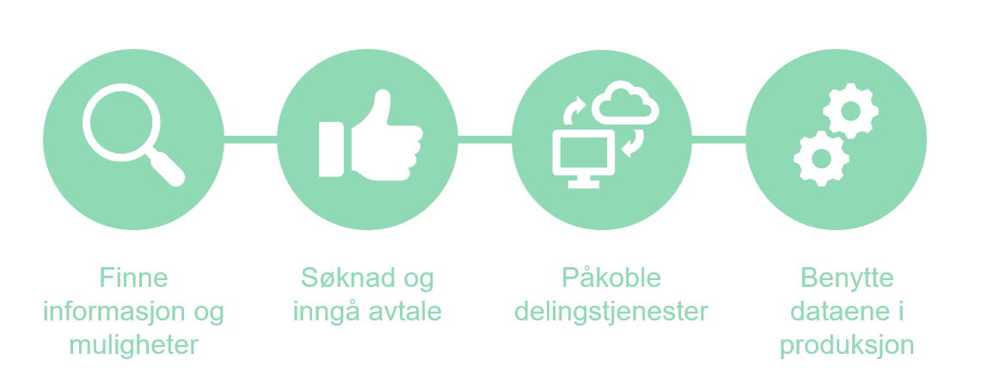

# Faser
 
Fasene man gjennomfører ved oppkobling mot tjenestene kan beskrives som:
* Finne informasjon og muligheter
* Søknad og inngå avtale
* Påkoble delingstjenester
* Benytte dataene i produksjon

## Finne informasjon og muligheter
Fokus for fasen vil være å orientere seg om hvilken informasjon som er delt og hvordan den kan benyttes i egne forretningsprosesser.  
Man kan finne mer informasjon under under [om tjenestene](../om-tjenestene)

## Søknad og inngå avtale
Bruk av delingstjenester krever at man søker og inngår avtale om bruk. Her inngår godkjennelse av deling- og bruksvilkår  
Informasjon om hvordan man søker og inngår avtale finner du under [skatteetaten.no](https://www.skatteetaten.no/deling)

## Påkoble delingstjenester
Skatteetaten tilbyr ulike former for påkobling til delingstjenestene. Her må virksomheten ta stilling til hvilken modell som velges. Grovt sett kan man velge mellom
* Oppslag direkte via en nettleser via et sett med standard oppslag
* Gjennom et segmentsamarbeid
* Via en valg systemleverandør som databehandler
* Direkte integrasjon der virksomheten selv er databehandler  
Mer informasjon finnes under [påkobling](../pakobling-til-freg)

## Benytte dataene i produksjon
Det tilbys et sett med standardiserte tjenester og videre vil neste fase være å etablere en hensiktsmessig bruk av tjenestene.  
Mer informasjon finnes under [benytte data i produksjon](../konsumenttjenester)
